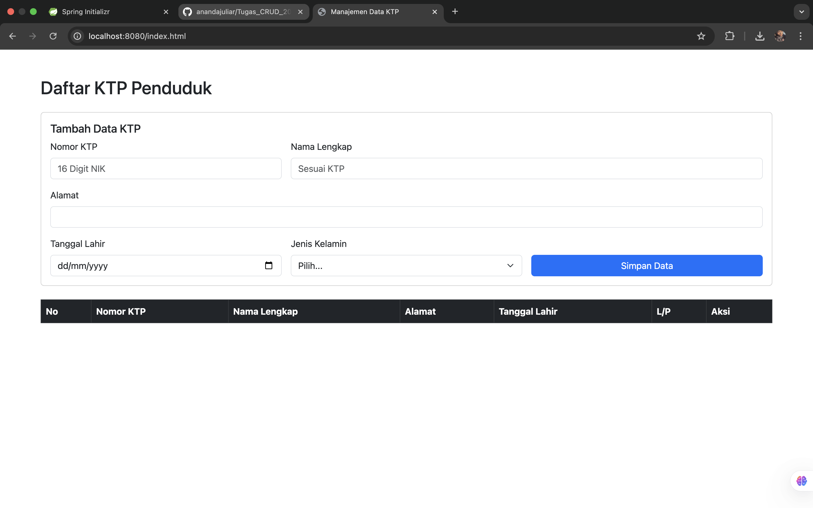
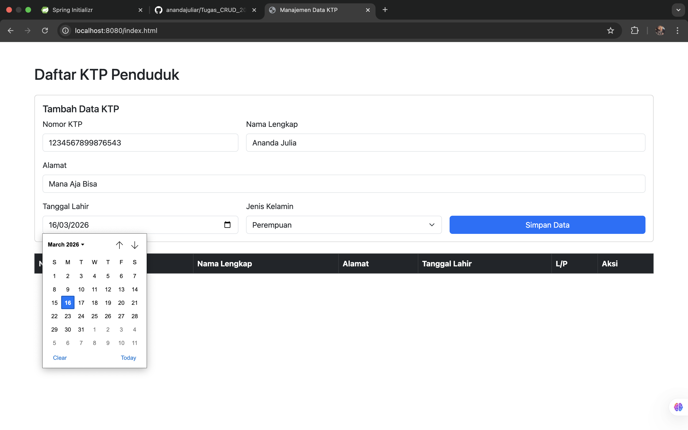
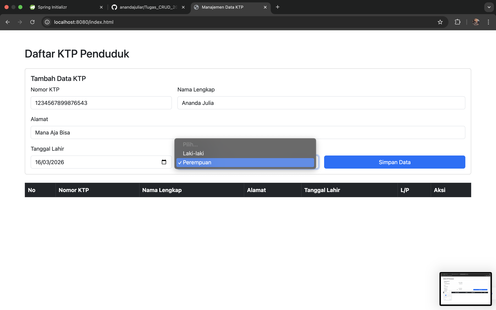
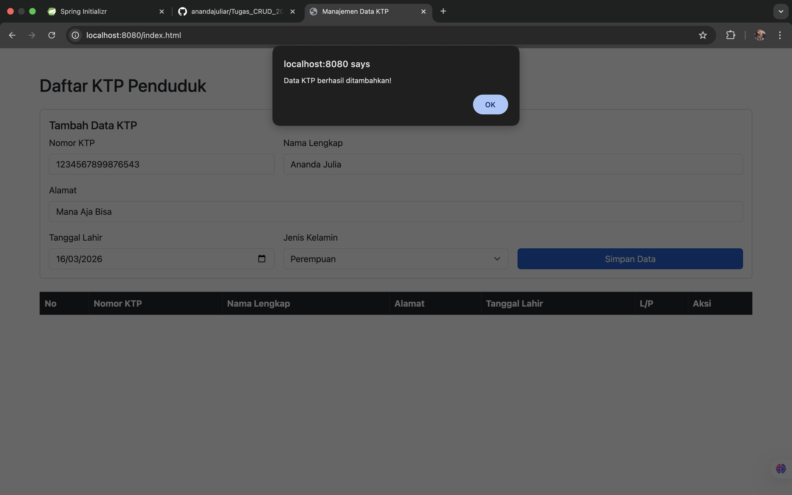
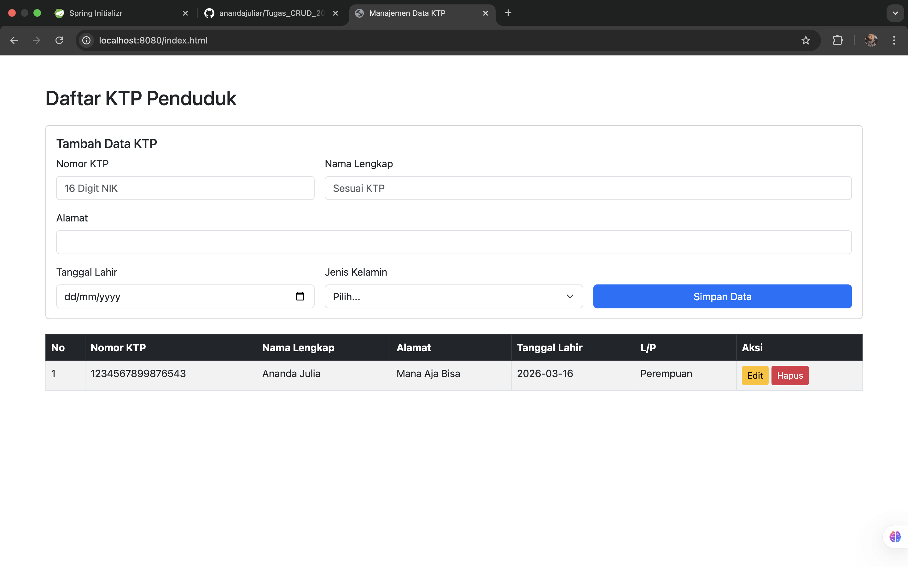
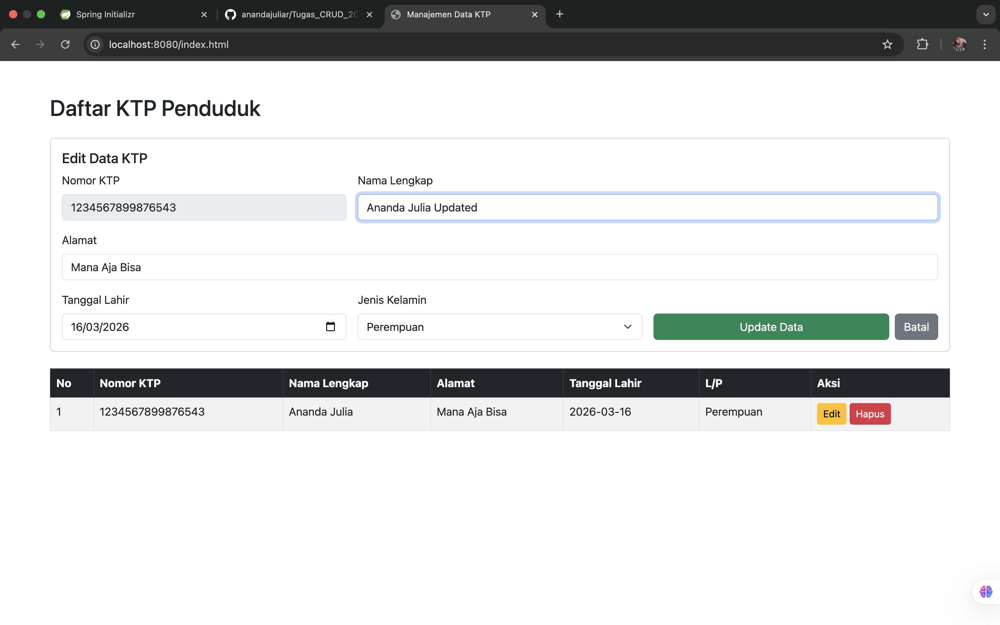
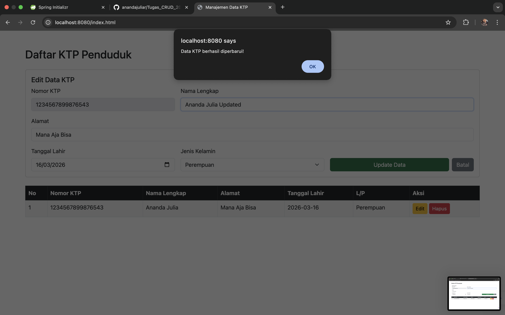
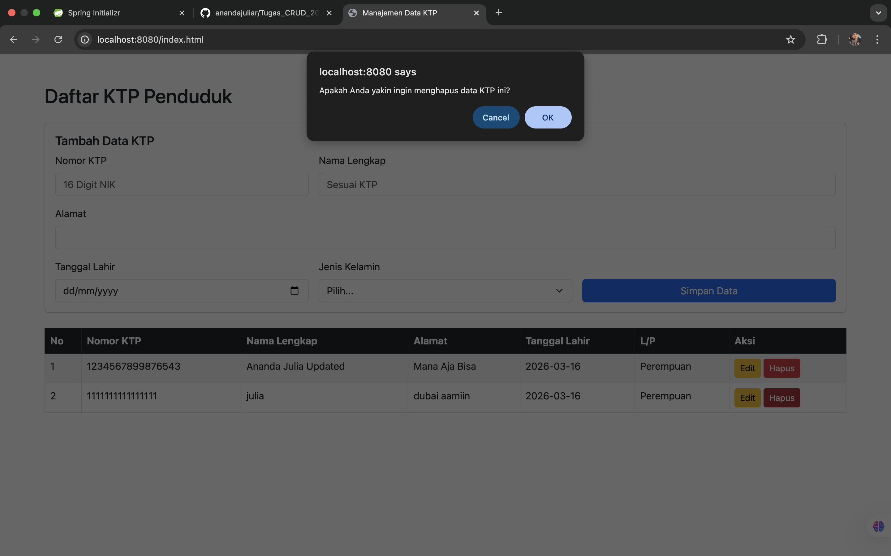
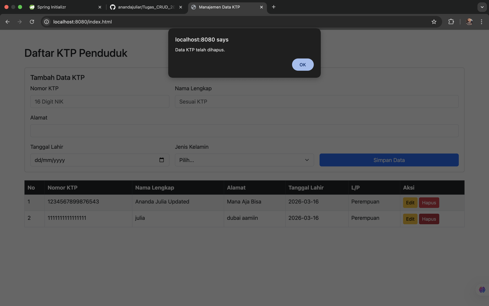

Ananda Julia (20230140046)

## Dokumentasi Endpoint API
| HTTP Method | Endpoint | Deskripsi |
| :--- | :--- | :--- |
| `POST` | `/ktp` | Menambahkan data KTP baru |
| `GET` | `/ktp` | Mengambil seluruh data KTP |
| `GET` | `/ktp/{id}` | Mengambil data KTP berdasarkan ID |
| `PUT` | `/ktp/{id}` | Memperbarui data KTP berdasarkan ID |
| `DELETE` | `/ktp/{id}` | Menghapus data KTP berdasarkan ID |

## Dokumentasi Tampilan Website 
| Dokumentasi | 
| :--- |
|  | 
|  | 
|  | 
|  | 
|  | 
|  | 
|  | 
|  | 
|  | 
|  | 
